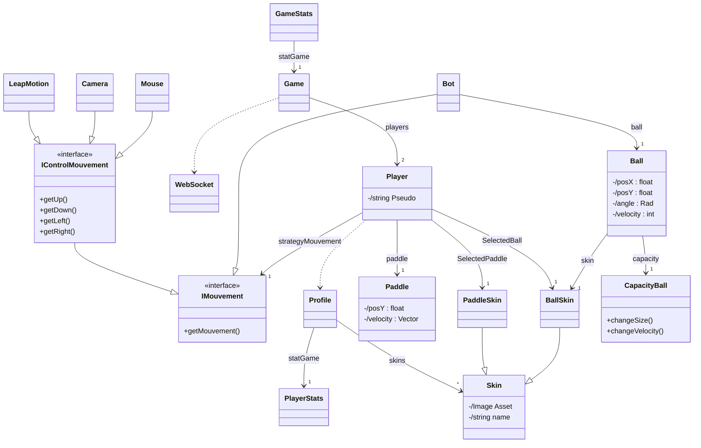

```mermaid
classDiagram

    

    class IMouvement{
        +getMouvement()
    }
    <<interface>> IMouvement

    
    

    class IControlMouvement{
        +getUp()
        +getDown()
        +getLeft()
        +getRight()
    }
    <<interface>> IControlMouvement
    IControlMouvement --|> IMouvement

    class LeapMotion{

    }
    LeapMotion --|> IControlMouvement

    class Camera{

    }
    Camera --|> IControlMouvement

    class Mouse{

    }
    Mouse --|> IControlMouvement
    

    class PlayerStats{
        
    }

    class Profile{
        
    }
    Profile --> "1" PlayerStats : statGame
    Profile --> "*" Skin :skins
    
    

    class Paddle{
        -/posY : float
        -/velocity : Vector
    }
    
    
    class WebSocket{

    }

    class GameStats{
    }
    GameStats --> "1" Game : statGame   

    class Game{

    }
    Game --> "2" Player : players
    Game ..> WebSocket

    
    
    class Bot{

    }
    Bot --> "1" Ball : ball
    Bot --|> IMouvement 

    


    class Player{
        -/string Pseudo
    }
    Player --> "1" IMouvement : strategyMouvement
    Player --> "1" Paddle : paddle
    Player ..> Profile
    Player --> "1" BallSkin : SelectedBall
    Player --> "1" PaddleSkin : SelectedPaddle
    
    
    

    class Skin{
        -/Image Asset 
        -/string name
    }

    class PaddleSkin{

    }
    PaddleSkin --|> Skin

    class CapacityBall{
        +changeSize()
        +changeVelocity()
    }
    
    class BallSkin{

    }
    BallSkin --|> Skin

    

    class Ball{
        -/posX : float
        -/posY : float
        -/angle : Rad
        -/velocity : int
    }
    Ball --> "1" CapacityBall : capacity
    Ball --> "1" BallSkin : skin
    

    

    

    
    
    
    

```

