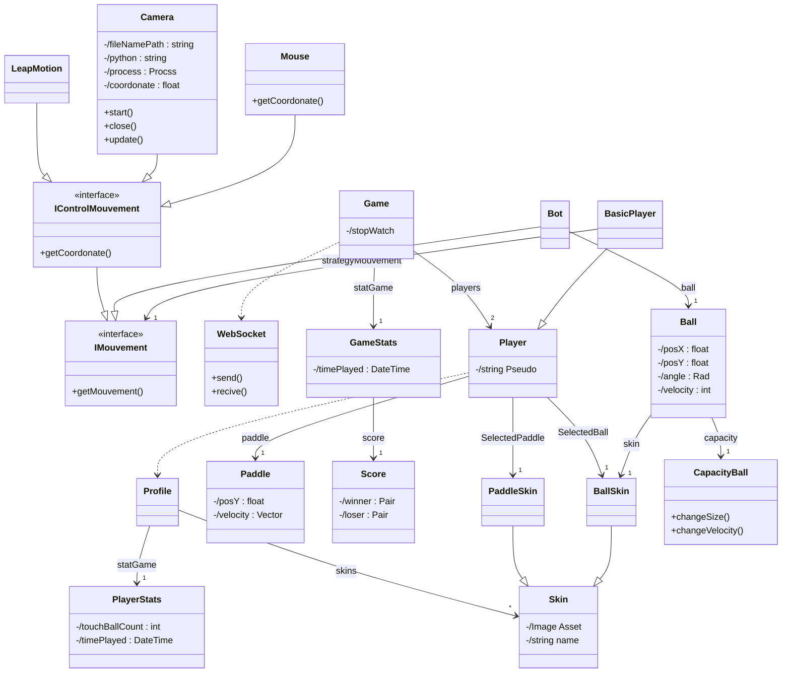

```mermaid
classDiagram

    

    class IMouvement{
        +getMouvement()
    }
    <<interface>> IMouvement

    
    

    class IControlMouvement{
        +getCoordonate()
    }
    <<interface>> IControlMouvement
    IControlMouvement --|> IMouvement

    class LeapMotion{

    }
    LeapMotion --|> IControlMouvement

    class Camera{
        -/fileNamePath : string
        -/python : string
        -/process : Procss
        -/coordonate : float
        +start()
        +close()
        +update()
    }
    Camera --|> IControlMouvement

    class Mouse{
        +getCoordonate()
    }
    Mouse --|> IControlMouvement
    

    class PlayerStats{
        -/touchBallCount : int
        -/timePlayed : DateTime

    }

    class Profile{
        
    }
    Profile --> "1" PlayerStats : statGame
    Profile --> "*" Skin :skins
    
    

    class Paddle{
        -/posY : float
        -/velocity : Vector
    }
    
    
    class WebSocket{
        +send()
        +recive()
    }

    class Score{
        -/winner : Pair<Profile, int>
        -/loser : Pair<Profile, int>
    }

    class GameStats{
        -/timePlayed : DateTime
        
    } 
    GameStats --> "1" Score : score

    class Game{
        -/stopWatch

    }
    Game --> "1" GameStats : statGame
    Game --> "2" Player : players
    Game ..> WebSocket
    

    
    
    class Bot{

    }
    Bot --> "1" Ball : ball
    Bot --|> IMouvement 

    class BasicPlayer{

    }
    BasicPlayer --> "1" IMouvement : strategyMouvement
    BasicPlayer --|> Player
    

    class Player{
        -/string Pseudo
    }
    Player --> "1" Paddle : paddle
    Player ..> Profile
    Player --> "1" BallSkin : SelectedBall
    Player --> "1" PaddleSkin : SelectedPaddle
    
    

    class Skin{
        -/Image Asset 
        -/string name
    }

    class PaddleSkin{

    }
    PaddleSkin --|> Skin

    class CapacityBall{
        +changeSize()
        +changeVelocity()
    }
    
    class BallSkin{

    }
    BallSkin --|> Skin

    

    class Ball{
        -/posX : float
        -/posY : float
        -/angle : Rad
        -/velocity : int
    }
    Ball --> "1" CapacityBall : capacity
    Ball --> "1" BallSkin : skin
    

    

    

    
    
    
    

```

