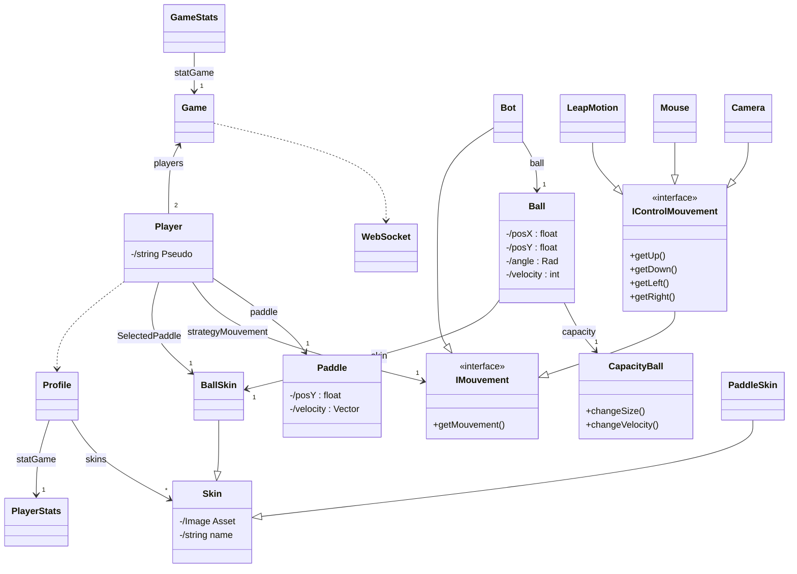

```mermaid
classDiagram

    class WebSocket{

    }

    class Game{


    }
    Game <-- "2" Player : players

    class GameStats{
    }
    GameStats --> "1" Game : statGame 

    class Profile{
        
    }
    Profile --> "1" PlayerStats : statGame
    Profile --> "*" Skin :skins

    class Skin{
        -/Image Asset 
        -/string name
    }

    class Player{
        -/string Pseudo
    }
    Player ..> Profile
    Player --> "1" BallSkin : SelectedPaddle
    Player --> "1" IMouvement : strategyMouvement
    Player --> "1" Paddle : paddle

    class PlayerStats{
        
    }

    class IMouvement{
        +getMouvement()
    }
    <<interface>> IMouvement


    class IControlMouvement{
        +getUp()
        +getDown()
        +getLeft()
        +getRight()
    }
    <<interface>> IControlMouvement

    class Ball{
        -/posX : float
        -/posY : float
        -/angle : Rad
        -/velocity : int
    }
    Ball --> "1" BallSkin : skin
    Ball --> "1" CapacityBall : capacity

    class CapacityBall{
        +changeSize()
        +changeVelocity()
    }

    class Paddle{
        -/posY : float
        -/velocity : Vector
    }

    
    
    
    
    Bot --|> IMouvement
    IControlMouvement --|> IMouvement
    LeapMotion --|> IControlMouvement
    Mouse --|> IControlMouvement
    Camera --|> IControlMouvement
    Game ..> WebSocket
    PaddleSkin --|> Skin
    BallSkin --|> Skin
    
    Bot --> "1" Ball : ball
    
```